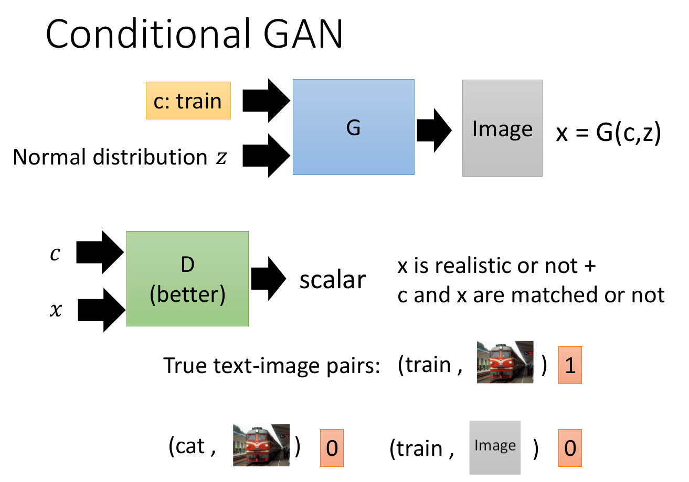

# GAN-李宏毅

## Introduction

### Basic Idea of GAN

Algorithm

训练D和G的时候迭代次数各自是个hyperprameter

### GAN as structured learning

#### Why structured learning challenging

1.  One-shot/Zero-shot Learning:
   1. in classification, each class has some examples
   2. In sturcured learning,
      1. Consider each possible output as a "class"
      2. Since the output space is huge, most "classes" do not have any training data
      3. Machine has to create new stuff during testing
2. Machine has to learn to do planning
   1. Machine generates objects component-by-component, but it should have a big picture in its mind.
   2. Because the output componets have dependecy, they should be condisdered globally.

### Can generator learn by itself?

Auto-Encoder

Variational Auto-Encoder

但这种方式中元素之间的关系容易被忽略，比如像素间位置关系。需要增加网络参数。

往往在网络结构相同的情况下，有Discriminator的GAN效果要比Auto-Encoder的Decoder更好。

### Can Discriminator generate

Discriminator: Evaluation Function, Potential Function, Energy Function

首先，Discriminator分辨像素间关系要比Generator容易得多

如何训练Discriminator问题：

先假设Discriminator确实能够生成图片。 

​	数据库中只有正例，需要额外生成反例。

 

## Conditional GAN

Text-to-Image

Traditional Supervised approach: 容易产生数据集中多张Image平均的模糊图片

GAN：
	如果Discriminator只有图片的输入，那么Generator就会直接产生数据集中的图片，无视条件输入。所以Discriminator需要三种输入。

上图是两种Discriminator网络结构设计，下面的结构可以将两种Negative Sample的情况分开。

### StackGAN

### ### Image-to-Image

PatchGAN

### Speech Enhancement

### Video Generation

## Unsupervised Conditional Generation

1. Direct Transfomation(For texture or color change)

   1. 直接用GAN转换，忽略Generator偷懒的问题
   2. DTN
   3. CycleGAN（CycleGAN: a Master of steganography)
      1. 容易产生hidden information，难以被发现。Cycle Consistency不一定work
      2. Dual GAN
      3. Disco GAN
   4. StarGAN(Cross-domain transformation)
      1. 其实还是用了Cycle Consistency扩展到了多个Domain

2. Projection to Common Space(Larger Change)

   

   Training

   

   训练中会遇到问题，因为两者分开训练，那么中间曾的codes不能通用。

   ​	a.参数共用 Couple GAN/ UNIT	

   ​	b.Domain Discriminator判断中间层embedding vector是来自与哪个Domain， 那么他就限制了这个vector中feature的distribution在两个domain中相同。

   ​	c.Cycle Consistency--Combo GAN

   

   ​	d.Semantic Consistency--DTN，XGAN：与Cycle Consistency相似，比较latent space中embedding vector的相似程度

   

## Theory behind GAN

## fGAN: General Framework of GAN

用不同的divergence用于测量real data和generated data的差距，都是可以完成的

这个接下来有证明，我就不放了，就是证明任何Divergence最后都能与GAN扯上关系，都可以用来测量real data 和generated data的距离。

Model Collapse:

1. real data的distribution很大，但是generated data的distribution范围很小，同样的生成样本一直出现。

Mode Dropping:

1. generator产生的数据落在某个区域里

上图中表示了不同的divergence会导致生成不同的结果

1. 第一图对应了传统的根据极大似然估计原理进行的生成，容易看到最后的结果落在两个分布之间，解释了为何会模糊。

2. 第二图对应了传统的GAN应用的KL divergence的结果，最后的结果与原始数据中的某一个分布比较接近，导致生成结果出现Mode Collapse或Mode Dropping

3. 更换divergence原理上会缓解这种情况，但最终还是有Mode Collapse或Mode Dropping的结果

4. 解决方法，，，，每一张图训练一个generator。。。。这不是搞笑么。。。

   

## WGAN

大多数情况下生成的数据和原始数据的分布是不重合的‘

1. 因为数据中二者都是高位空间中对应的低维Manifold，比如上面两条曲线重合部分就非常小。
2. 就算两个distribution是有重合的，但是由于sample的数量不足也不会出现许多重合，甚至还是完全两个分布

JS divergence在不重合的情况下，永远都是log2。尽管各个generated data分布与real data分布距离并不相同，但最后的loss是一样的。

另外，GAN的网络结构中discriminator在generator之后，generator在训练的过程中，尽管discriminator是固定的，但是最后的导数中，gennerator是顺着discriminator给出的梯度方向进行更新，那么这个discirminator训练得越好，sigmoid函数会使的左右两边的梯度都趋近于0,导致generator没法训练。

为了解决这个问题，LSGAN将sigmoid换成了Linear regression

这个对Wasserstein Distance的距离的解释蛮有趣的，推土机挪土

这里需要D是一个1-Lipschitz Function，这是为了避免后面那个优化目标变得无穷大。总之，1-Lipschitz Function最大的特点就是“平滑”。

由于给discriminator的参数限制是相对比较困难的，所以使用Weight Clipping，直接限制权重的大小。 

这个WGAN-GP太多的trick都提到experimentally了

这篇论文成功做到了将每一个参数的梯度限制到1以下。

## EBGAN

这个方法里面，generator是不变的。把discriminator换成了由AutoEncoder构成的结构，loss变成了重建后的图片与原图的重建误差。思想在于如果一个图片可以被被重建的越好，那么这张图质量就足够好。这个方法在于AutoEncoder可以用real data预训练。

但是要注意的是，这个重建的话如果你不限制discriminator中的autoencoder，那么由于重建要比destroy难得多，它就直接把所有的图直接重建成noise了，大不了全是noise，这个时候loss还是可以很小。所以要有个超参数margin。

为了避免一些生成的非常好的的图片还是被discriminator分辨为generated data，他就对这些生成的比较好的图片给了相对来说比较小的loss

## Info GAN

一般的GAN在输入改变某一个维度并不会对结果造成啥不同，或者说每个维度的意义是不明的。

这里Classifier就是为了去看究竟c的某一个唯独的作用，为了避免生成器直接把c贴在图片上，后面还是需要discriminator。一般情况下，discriminator和Classifier都会共享参数。

为了能够让classifier能够清楚知道原来的c是什么，那么generator必须让原本的c对生成的图片有明确的影响。

z'就表示一些随机的东西，这个c和z'的划分是没啥可解释的。“不是因为代表了某些特征，才会被设为c，而是因为它被设为c，根据InfoGAN的training才会使得它代表某些特征。”

## VAE-GAN

本身VAE生成的图片是比较模糊的，后面的discriminator会使图片尽量真实。由于VAE-GAN是知道real data的分布的，所以他的训练更稳定一点。

注意：这里有三种样本，一种是real data，一种是real data经过EN-DE之后得到的data，一种是从normal distribution里采样z之后生成的data。

训练目标里包括：

1. real data和由他EN-DE之后得到的data之间的重建误差比较小--Updata Encoder
2. 希望由real data经过EN-DE之后得到的data可以骗过Discriminator，就是由real data经过EN-DE之后得到的data与从normal distribution里采样z之后经过EN-DE之后生成的data对于Discriminator都得到比较大的结果--Update Decoder
3. 希望Discriminator用二分类能够分辨出三种数据/另一种做法就是直接把Discriminator当作三分类的分类器。

## BiGAN/ALI

这个把Encoder和Decoder分开了，不在一起训练，他用之后的discriminator分辨数据是来自encoder还是decoder

上面的P(z)是一个Normal Distribution 

这个可以就是把两个分布P(x,z)和Q(x,z)通过训练的过程越接近越好

这张图里说的是，BiGAN的方式如果能够达到最优解，那么他的结果和学习两个相反的EN-DE的效果是一样的。但是其实毕竟是不同的，那么两者都不能到optimal solution，所以结果就不太相同。另外，EN-DE的方式生成的图片与输入会非常相似但是模糊，BiGAN的生成结果与输入不同但是很清晰。BiGAN更容易获得语义上的信息。

## Triple GAN（TODO）

是一个Semi-supervised的方法，这种方法里

## Domain-adversarial training

feature extractor	提取特征

label predictor	预测种类

domain classifier	分辨来自哪个Domain，这样就能使提取出的feature能在两个域里面通用

三者可以同时训练，也可以分开训练

拿语音方面做例子，那么这个东西就可以把一段语音中是哪个人说的的“声纹信息”和具体说的内容的“文字信息”分开。

